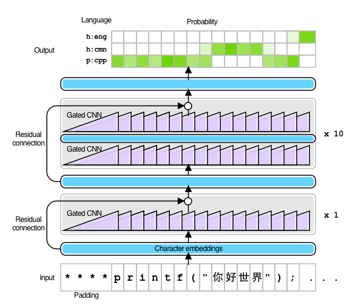

# NanigoNet

[Masato Hagiwara](http://masatohagiwara.net/)

NanigoNet is a language detector for code-mixed input supporting 150 human and 19 programming languages implemented using [AllenNLP](https://allennlp.org)+[PyTorch](https://pytorch.org). 



Unlike other language detectors, NanigoNet detects language per character using a [convolutional neural network](https://arxiv.org/abs/1612.08083)-based sequential labeling model, which makes it suitable for code-mixed input where the language changes within the text (such as source code with comments, documents with markups, etc.). It can also produce prediction results for the entire text.

There is another language detector, [LanideNN](https://ufal.mff.cuni.cz/tom-kocmi/lanidenn), which also makes a prediction per character. There are some notable differences between NanigoNet and LanideNN, including:

* NanigoNet supports [more human languages](languages.tsv), including Esperanto and Hawaiian
* NanigoNet detects 19 major programming languages
* NanigoNet uses a more modern neural network architecture ([gated convolutional neural networks](https://arxiv.org/abs/1612.08083) with [residual connections](https://arxiv.org/abs/1512.03385))
* NanigoNet is implemented on [AllenNLP](https://allennlp.org)+[PyTorch](https://pytorch.org) while LanideNN uses TensorFlow
* NanigoNet detects Simplified and Traditional Chinese separately (very important for my use cases)
* NanigoNet only uses CC-BY-SA resources, meaning you are free to use the code and the model for commercial purposes

Many design decisions of NanigoNet, including the choice of the training data, are influenced by LanideNN. I hereby sincerely thank the authors of the software.

"Nanigo" (何語) means "what language" in Japanese.

# Supported languages

See [languages.tsv](languages.tsv).

NanigoNet uses a unified set of languages IDs both for human and programming languages. Human languages are identified by a prefix `h:` + 3-letter ISO 639-2 code (for example, `h:eng` for English). Only exception is `h:cmn-hans` for Simplified Chinese and `h:cmn-hant` for Traditional Chinese.

For programming languages, it uses a prefix `p:` + file extension most commonly used for that language (for example, `p:js` for JavaScript and `p:py` for Python). 

# Pre-requisites

* Python 3.6.1+
* AllenNLP 0.9.0+

# Install

* Clone the repository
* Run `pip install -r requirements.txt` under a clean Python virtual environment
* Download the [pre-trained model](https://nanigonet.s3.amazonaws.com/models/model.744k.256d.gcnn.11layers.tar.gz) and put it in the same directory

# Usage

From command line:

```
$ python run.py [path to model.tar.gz] < [input text file]
```

From Python code:
```
from nanigonet import NanigoNet

net = NanigoNet(model_path=[path to model.tar.gz])
texts = ['Hello!', '你好!']
results = net.predict_batch(texts)
```

This produces a JSON object (or a Python dictionary) per input instance. The keys of the object/dictionary are:

* `char_probs`: list of per-char dictionaries of `{lang_id: prob}`    
* `char_best`: list of per-char language IDs with the largest probability  
* `text_probs`: dictionary of `{lang_id: prob}` for the input text
* `text_best`: Language ID for the input text with the largest probability 

Example:

```
$ echo 'Hello!' | python run.py model.744k.256d.gcnn.11layers.tar.gz | jq .
{
  "char_probs": [
    {
      "h:eng": 0.9916031956672668,
      "h:mar": 0.004953697789460421,
      "h:sco": 0.0008433321490883827
    },
    ...
  "text_probs": {
    "h:eng": 0.9324732422828674,
    "h:ita": 0.0068493434228003025,
    "h:spa": 0.006260495167225599
  },
  "char_best": [
    "h:eng",
    "h:eng",
    "h:eng",
    "h:eng",
    "h:eng",
    "h:eng"
  ],
  "text_best": "h:eng"
}
```

Usage of `run.py`:

```
usage: run.py [-h] [--top-k TOP_K] [--cuda-device CUDA_DEVICE]
              [--batch-size BATCH_SIZE]
              archive_file
```

Parameters to the constructor of `NanigoNet`:

* `model_path`: path to the pre-trained model ifle
* `top_k`: number of predictions returned with results in `char_probs` and `text_probs`
* `cuda_device`: GPU index to use for prediction (specify `-1` for CPU)

# Notes

* The training data for human languages comes mainly from Wikipedia ([Web To Corpus](http://ufal.mff.cuni.cz/w2c)) and [Tatoeba.org](https://tatoeba.org). For programming languages, I used randomly sampled code from Github repositories with permissive licenses (e.g., Apache 2.0) and file extensions.
* More pre-trained models may be released in the future.
* If you speak one of the supported languages and find weird results, let me know! In particular I'm interested in expanding Arabic to different dialects spoken in different regions and by social groups.
